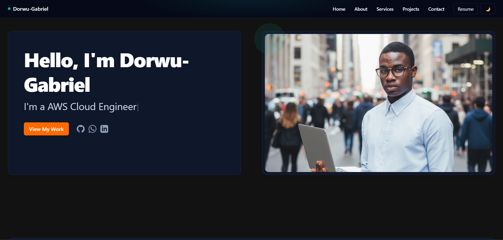

# Dorwu Gabriel - Portfolio

Welcome to my professional portfolio! This is a showcase of my work as a web developer, featuring projects that demonstrate my skills in modern web technologies.



## Featured Projects

### 1. Currency Converter App
A responsive web application for real-time currency conversion with a clean, dark theme interface.
- **Live Demo**: [View Live](https://currency-converter-app-57lk.vercel.app/)
- **Tech Stack**: React, Vite, Tailwind CSS

### 2. Recipe Sharing Platform
A community-driven platform for sharing and discovering recipes with a beautiful, user-friendly interface.
- **Live Demo**: [View Live](https://recipe-sharing-platform-tau.vercel.app/)
- **Tech Stack**: React, Node.js, MongoDB

### 3. Ecoprotin
An e-commerce platform for eco-friendly protein products.
- **Live Demo**: [View Live](https://www.ecoprotin.com/)
- **Tech Stack**: (Information not specified)

## Technologies & Tools

- **Frontend**: React, Vite, Tailwind CSS
- **Backend**: Node.js, Express
- **Database**: MongoDB
- **Version Control**: Git, GitHub
- **Deployment**: Vercel, Netlify

## Getting Started

### Prerequisites
- Node.js (v16 or higher)
- npm (v8 or higher) or yarn

### Installation

1. Clone the repository:
   ```bash
   git clone https://github.com/Dorwu-Gabriel/Dorwu-Portfolio.git
   cd Dorwu-Portfolio
   ```

2. Install dependencies:
   ```bash
   npm install
   # or
   yarn install
   ```

3. Start the development server:
   ```bash
   npm run dev
   # or
   yarn dev
   ```

4. Open [http://localhost:3000](http://localhost:3000) to view it in your browser.

## Build

To create a production build:

```bash
npm run build
# or
yarn build
```

## License

This project is licensed under the MIT License - see the [LICENSE](LICENSE) file for details.

## Contact

- **Email**: [mathesond.gabriel90@gmail.com](mailto:mathesond.gabriel90@gmail.com)
- **LinkedIn**: [Dorwu Gabriel](https://www.linkedin.com/in/dorwu-gabriel-6b34701a3/)
- **GitHub**: [@Dorwu-Gabriel](https://github.com/Dorwu-Gabriel/Dorwu-Portfolio)

---

Feel free to explore my projects and don't hesitate to reach out for collaborations or opportunities!
